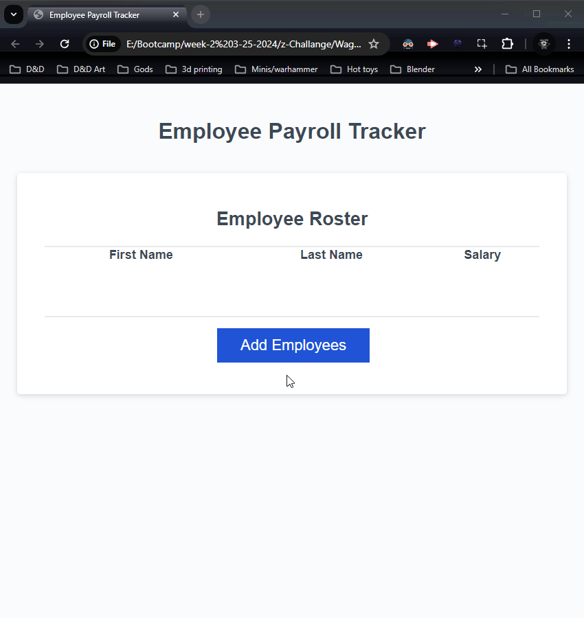

# Employee Tracker

## Description

    In this we are capturing user input from Prompts,
    to display on the webpage and laying the out in an easy to ready table.
    In the console logs it will calculate the average salary of all employees,
    and select a random one at random for a lottery. 

## Table of Contents

- [Usage](#usage)
- [License](#license)

## Usage
    Click on the add button aa prompt will ask you to fill out your employees 
    information. 

## License

    MIT License

--- 

